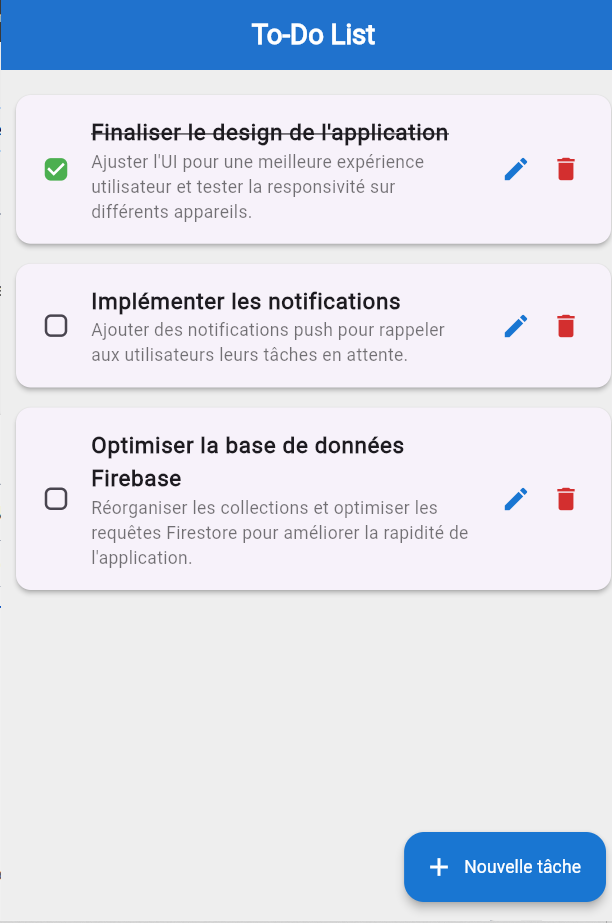

# 📋 To-Do List App

Une application de gestion de tâches développée avec **Flutter** et **Firebase**.

---

## 🚀 Fonctionnalités
✔ Ajouter des tâches  
✔ Modifier des tâches  
✔ Supprimer des tâches (avec confirmation)  
✔ Marquer une tâche comme **complète**  
✔ Stockage en **temps réel** avec Firebase  
✔ Interface **moderne et responsive**

---

## 🛠️ Technologies utilisées
- **Flutter** (Dart) 🦄
- **Firebase Firestore** (Base de données) 🔥

---

## 📌 Installation et exécution

### 1️⃣ Prérequis
- [Flutter](https://flutter.dev/docs/get-started/install) installé
- Un projet Firebase configuré ([Guide](https://firebase.flutter.dev/docs/overview/))

### 2️⃣ Cloner le projet
```sh
git clone https://github.com/ton-repo/todo-app.git
cd todo-app

3️⃣ Installer les dépendances
flutter pub get


4️⃣ Lancer l'application
flutter run

📸 Captures d'écran



<<<<<<< HEAD
=======

>>>>>>> 1e705fceadeccd0e10d6db26aa92ae5c4b446efb
📜 Structure du projet
lib/
│── main.dart           # Point d'entrée de l'application
│── splashScreen.dart   # page flash
│── task.dart           # Modèle de tâche
│── task_service.dart   # Service Firebase pour gérer les tâches
│── TaskListScreen.dart  # UI pour lister les tâches


✨ Auteur
👨‍💻 Laurel YAMA
📧 Contact : ngwambilaj@gmail.com

<<<<<<< HEAD
⭐ N'hésite pas à laisser un star sur le repo si tu trouves ce projet utile ! 🚀
=======
⭐ N'hésite pas à laisser un star sur le repo si tu trouves ce projet utile ! 🚀
>>>>>>> 1e705fceadeccd0e10d6db26aa92ae5c4b446efb
